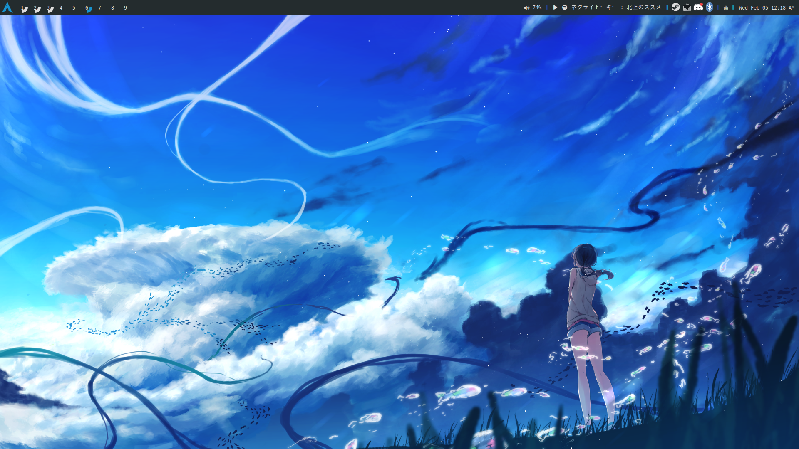
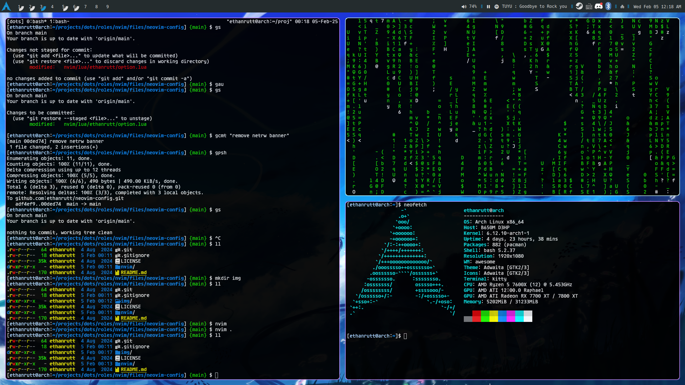

# ethanrutt awesomewm config
apologies for the lame name

This is a simple, minimal awesomewm config that gets the job done. It's meant
to not get in your way and have everything at your fingertips. Using the
keyboard for getting around is preferred in this configuration, as you won't
have titlebars (the thing at the top with the close and minimize buttons) or
other things that you normally have but really don't need. Looks aren't my
specialty, but this still gives a solid status bar with a lot of the features
and icons that I think are essential.

> [!NOTE]
> I used widgets from the `lain` repository, but I have copied the code and
> made it local to this repository since I didn't need a lot of the features
> that `lain` provides.

## Dependencies
- picom (specifically picom-arian8j2-git)
- nitrogen

## Images

